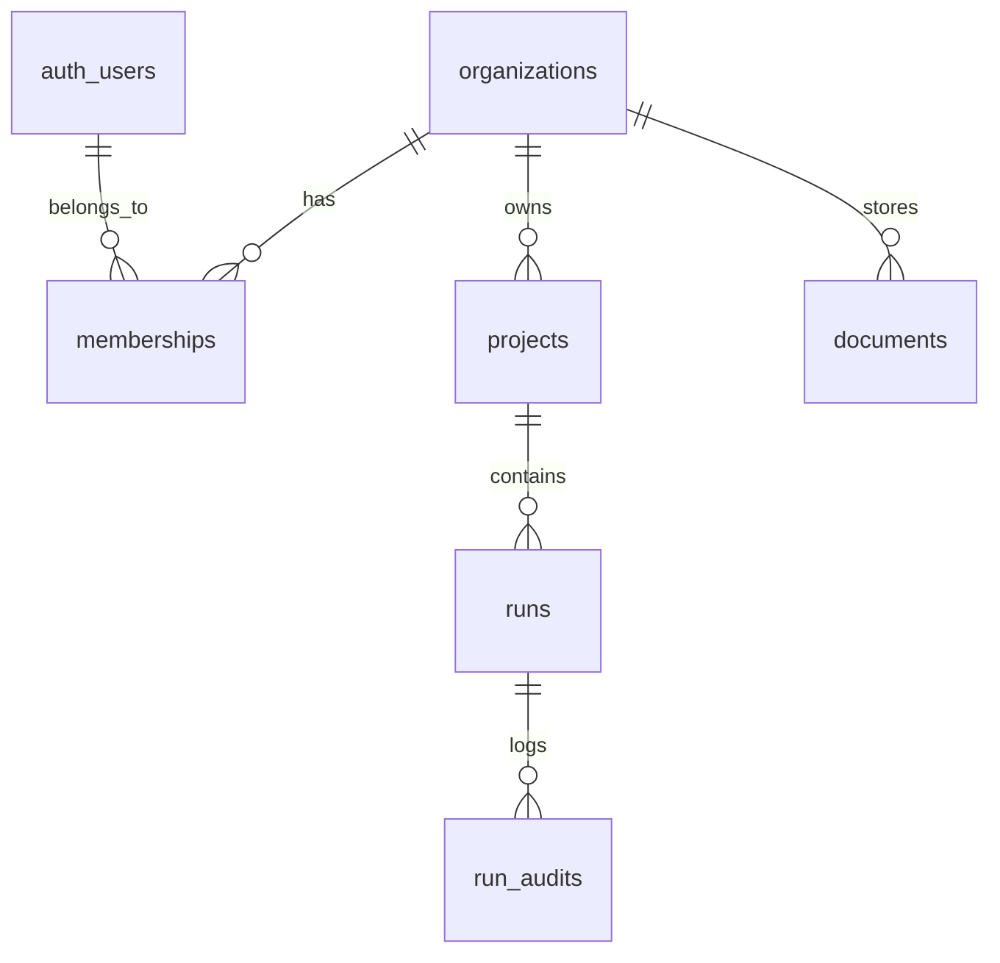

# Database Schema Map 🗺️

## High-Level Entity Relationships

## Core Tables

| Table | Purpose | Key Relationships |
| :--- | :--- | :--- |
| **organizations** | Tenancy Root | Linked to Stripe Customer |
| **memberships** | RBAC Junction | Links Auth Users to Orgs |
| **projects** | Workspace | Always belongs to an Org |
| **documents** | Knowledge Base | Chunks stored in vector table |
| **runs** | Process Log | Result of one questionnaire audit |
| **run_audits** | Evidence Log | Every AI answer + source citation |

## Hardening Rules

- **Multi-Tenancy**: Every row (except auth) MUST have `org_id`.
- **Soft Delete**: `deleted_at IS NOT NULL` rows are hidden from API.
- **RLS**: Policies check `auth.uid()` against `memberships`.
